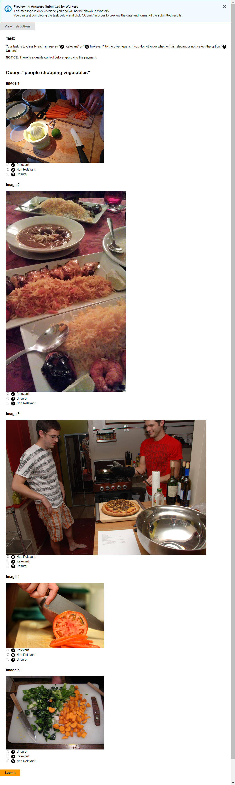

# ConQA description

ConQA is a crowd-sourced dataset extending the Visual Genome ids for the images. The goal of the dataset is to provide a benchmark for the image retrieval task. The dataset consists of 80 queries divided into 50 conceptual and 30 descriptive queries. A descriptive query mentions some of the objects in the image, for instance, `people chopping vegetables`. 
While, a conceptual query does not mention objects or only refers to objects in a general context, e.g., `working class life`. More information about the dataset can be found in the paper.

Images and scene graphs can be downloaded from the [Visual Genome Download page](https://homes.cs.washington.edu/~ranjay/visualgenome/api.html). For creating the dataset, we used the most up-to-date files up to version 1.4. The mapping between Visual Genome ids and MS-Coco ids can be found in the file [image_data.json.zip](https://homes.cs.washington.edu/~ranjay/visualgenome/data/dataset/image_data.json.zip).

The captions for the images are available on the [MS-Coco download site](https://cocodataset.org/#download). We used the 2017 Train/Val annotations.

## Dataset generation

For the dataset generation, we followed a 3 step workflow: filtering images, generating queries and seeding relevant, and crowd-sourcing extended annotations.

### Filtering images
The first step is focused on filtering images that have meaningful scene graphs and captions. To filter the images, we used the following procedure:
1. The image should have one or more captions. Hence, we discarded the YFCC images with no caption, obtaining $91\,524$ images from the MS-COCO subset of Visual Genome.
2. The image should describe a complex scene with multiple objects. We filtered all the scene graphs that did not contain any edges. $67\,609$ images pass this filter.
3. The relationships should be verbs and not contain nouns or pronouns. To detect this, we generated sentences for each edge as a concatenation of the words on the labels of the nodes and the relationship and applied Part of Speech tagging. We performed the POS Tagging using the model [en_core_web_sm provided by SpaCy](https://spacy.io/models/en). We filter all scene graphs that contain an edge not tagged as a verb or that the tag is not in an ad-hoc list of allowed non-verb keywords. The allowed keywords are top, front, end, side, edge, middle, rear, part, bottom, under, next, left, right, center, background, back, and parallel. We allowed these keywords as they represent positional relationships between objects. After filtering, we obtain $43\,413$ images.

### Generating Queries

To generate ConQA, the dataset authors worked in three pairs and acted as annotators to manually design the queries, namely 50 conceptual and 30 descriptive queries. After that, we proceeded to use the model "ViT-B/32" from CLIP to find relevant images. For conceptual queries, it was challenging to find relevant images directly, so alternative proxy queries were used to identify an initial set of relevant images. These images are the seed for finding other relevant images that were annotated through Amazon Mechanical Turk.

### Annotation crowdsourcing
Having the initial relevant set defined by the dataset authors, we expanded the relevant candidates by looking into the top-100 visually closest images according to a pre-trained ResNet152 model for each query. As a result, we increase the number of potentially relevant images to analyze without adding human bias to the task.

After selecting the images to annotate, we set up a set of Human Intelligence Tasks (HITs) on Amazon Mechanical Turk. Each task consisted of a query and 5 potentially relevant images. Then, the workers were instructed to determine whether each image is relevant for the given query. If they were not sure, they could alternatively mark the image as “Unsure”. To reduce presentation bias, we randomize the order of images and the options. Additionally, we include validation tasks with control images to ensure a minimum quality in the annotation process, so workers failing 70% or more of validation queries were excluded.

The following image presents an example of how the task was presented to the workers.



## Files:

* vg_subset.txt: a list of the Visual Genome Ids used for creating this dataset.
* seed.json: a Json file representing a dictionary {QueryId: QueryData}.
    * QueryData: a dictionary containing:
        * **Text**: text of the query. 
        * **Conceptual**: a boolean indicating if the query is a conceptual query.
        * **Seed**: list of images Visual Genome ids used for seeding the Mturk.
* mturk.json: a Json file representing a dictionary {QueryId: TaskData}. 
    * TaskData is a dictionary {vgId: Relevance}
        * **vgId**: Visual Genome Id of the image.
        * **Relevance**: is a three-element array representing the number of votes for Relevant, Non Relevant, and Unsure, respectively.

The folder `repro-kit` contains scripts to reproduce the reported results. More information can be found on the [readme file of the repro-kit](repro-kit/README.md).

## Citation

```
@misc{
    title={ConQA: Conceptual query answering in text-to-image retrieval},
    authors={Rodriguez, Juan Manuel and Tavassoli, Nima and
            Lissandrini, Matteo and Mottin, Davide and
            Levy, Eliezer and Lederman, Gil and Sivov, Dima},
    year={2023}
}
```
